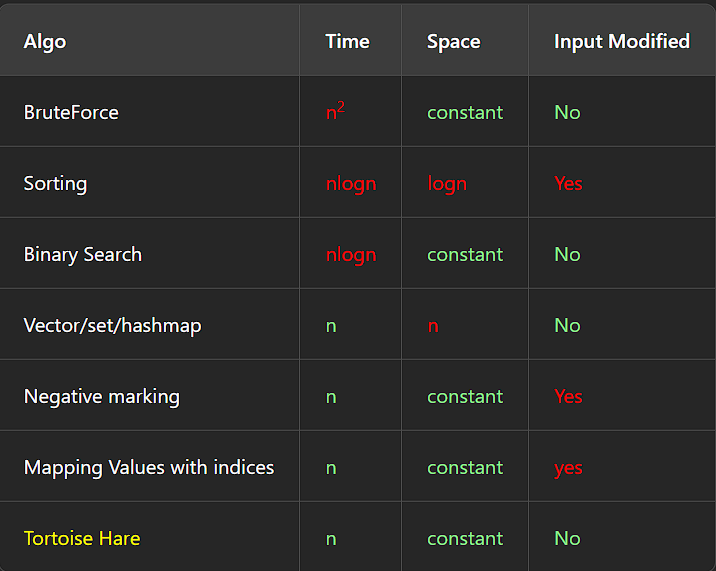

## 1 -  kadane's algorithm -> max subarray 
two at a time , compare and go ahead 

## 2 - tortoise Hare -> find duplicate in array 

useless shit logicless algorithm no realife usecase \
cyclic double and single step , 

## 3 - Moose -> Majority Element
more then n/2 and n/3 question 
